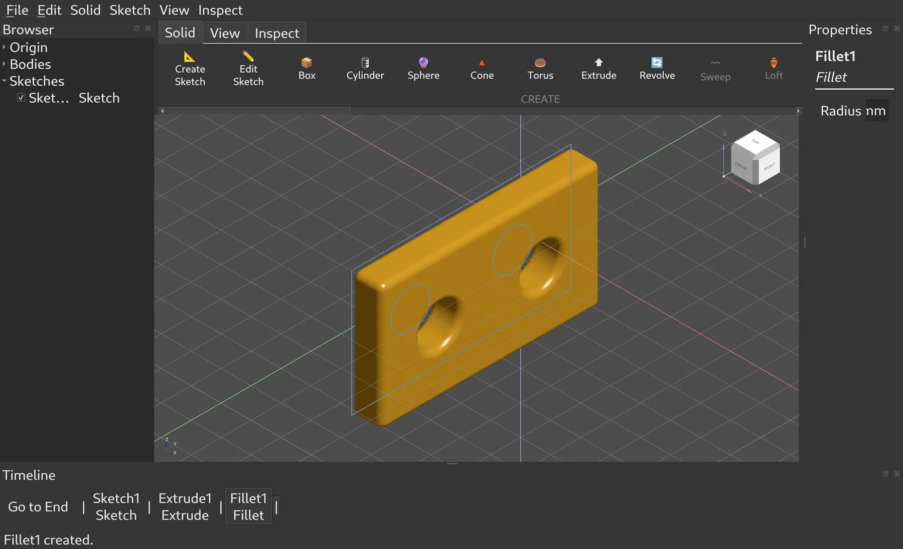

# PenguinCAD

A parametric solid modeller for Linux, built along the lines Fusion 360 draws:
a linear feature timeline, a constrained sketcher that drives it, and a browser
that lists what a design *contains* separately from the timeline that records
how it was *made*. Qt 6 for the UI, [OpenCASCADE][occt] 7.9 for geometry,
C++17, about 45,000 lines of source and 8,000 of tests. No dependencies beyond
Qt and OCCT.

One native window. No account, no cloud, no telemetry.

**It is early and half-built, and it is looking for help.** If you want a
Fusion-style CAD on Linux to exist, [CONTRIBUTING.md](CONTRIBUTING.md) lists
real, unclaimed work, from one-line Qt fixes to assemblies. You don't need to
know OpenCASCADE for most of it.



*The app as it is today, unretouched. The emoji toolbar, the clipped
properties field and the bare timeline are all good first issues.*

[occt]: https://dev.opencascade.org/

## Status

The modelling core works: you can sketch, constrain, dimension, extrude,
revolve, sweep or loft the result, cut or join it against what is already
there, pattern and mirror it, fillet and shell it, and go back afterwards and
change any number you typed. The timeline rebuilds, undo is exact, and the
properties panel edits features in place.

What it cannot do yet is **keep** anything. A native document format
(`.pcad`) is being built now; until it lands, a design exists only while the
process is running. Work can leave the app as STEP, OBJ or STL, but nothing
that leaves can be brought back in for editing.

So: worth trying if you want to see how far a Fusion-shaped modeller gets on
OCCT, or you want to help build one. Not yet something to do real work in.

`docs/FUSION360_COMPARISON.md` is a deliberately unsparing audit of where the
app stands against Fusion 360, and is the best place to look for what is
missing and what is worth doing next.

## What it can do today

Everything below is a registered command, reachable from the ribbon tab named
in the heading and mirrored into a menu of the same name.

### Sketching

Sketch on an origin plane or on any planar face of an existing body. The
Sketch tab is contextual: it appears when a sketch opens and disappears on
Finish.

- **Lines** (chained), **rectangles** (2-point, centre, 3-point at an angle),
  **circles** (centre-diameter, 2-point, 3-point), **arcs** (centre, 3-point,
  tangent), **polygons** (inscribed, circumscribed, edge), **ellipse**,
  **centre-to-centre slot**, **fit-point spline**, **control-point spline**,
  **conic** (rho-driven ellipse/parabola/hyperbola), **point**.
- **Trim**, **extend**, **offset**, **fillet**, **mirror**, **rectangular and
  circular pattern**, and a **construction** toggle that turns selected curves
  into reference geometry and back.
- Axis inference and snapping while you draw, and on-canvas value boxes you can
  type into: type a length or angle mid-gesture and that value locks while the
  mouse keeps controlling the rest.

### Constraints and dimensions

A self-contained Levenberg-Marquardt (damped Gauss-Newton) solver over the
entities' own defining values, with a small dense Gaussian elimination inside
it — no third-party solver.

- Twelve relations: coincident, horizontal, vertical, parallel, perpendicular,
  equal, tangent, midpoint, concentric, collinear, symmetric, and fix/unfix.
- Six driving dimension kinds: distance, horizontal distance, vertical
  distance, radius, diameter, angle. A dimension is not an annotation — edit
  its value and the solver moves the geometry.
- A constraint that would over-constrain the sketch is rejected and rolled
  back rather than applied.
- Constraint glyphs and dimensions can be shown or hidden.

### Solid features (Solid tab)

- **Primitives:** box, cylinder, sphere, cone, torus.
- **Extrude** (distance, reversed, symmetric) and **Revolve** (angle, about a
  sketch or world axis, reversed), both acting on the whole sketch or on
  individually picked profile regions.
- **Sweep** — a profile driven along a path sketch, with Fusion's
  perpendicular/parallel orientation and taper and twist angles. The path must
  be a *closed* sketch profile; open paths are not supported yet and the
  feature says so rather than guessing.
- **Loft** — a solid blended through two or more profiles in the order given,
  with Closed and Ruled options. No guide rails or centerline.
- Every one of those carries Fusion's **operation dropdown** — New Body, Join,
  Cut, Intersect — so a feature can add to or subtract from what the timeline
  has already built. It lives in `src/features/FeatureUtils.h`, and there is
  exactly one implementation of it in the codebase.
- **Combine** (Modify) — Join, Cut or Intersect bodies that already exist.
  Select them in the viewport and the dialog only asks which is the target, or
  pick target and tool from name dropdowns; the tool is consumed unless Keep
  Tools is on. Each pick carries a volume and centroid alongside its name and
  is resolved against the shape actually in hand, so a combine that can no
  longer find its inputs fails out loud instead of operating on the wrong body.
- **Rectangular pattern**, **circular pattern** and **mirror** at the solid
  level. These copy *bodies*, not features, and march along or turn about a
  world axis (mirror: a world plane) rather than an arbitrary one.
- **Press/Pull** with its own drag gizmo: select a face, drag the arrow, and
  the drag lands on the timeline as an editable feature rather than a one-off
  nudge.
- **Fillet**, **chamfer**, **shell**.
- **Move/Rotate** gizmo (translation arrows and rotation rings; no scale
  handle) plus a numeric Move/Rotate dialog. Both produce timeline features.
  Know the limit before you use it: the feature they create transforms the
  whole upstream shape, so in a document holding more than one body it moves
  every body, not just the one the gizmo is attached to.
- **Construction geometry:** offset / angled / midplane / 3-point planes, axes
  through two points or along a plane's normal, points by coordinates or at an
  axis-plane intersection. These are fully parametric, appear in the browser
  and are drawn in the viewport (translucent orange planes, dashed axes,
  point markers), but nothing outside the construction commands consumes them
  yet — you cannot currently sketch on a construction plane or revolve about a
  construction axis.
- **Selection filters** for bodies, faces, edges and vertices — independent
  checkboxes, as in Fusion — and **Selection Priority** (body, face or edge
  only) for when geometry is crowded.

### Parameters

- **MODIFY > Change Parameters** is Fusion's dialog: user parameters you name
  (`plate_width`, `hole_dia = plate_width / 4`) and every feature dimension
  as a model parameter, all editable in place, every edit undoable.
- **Any numeric field takes an expression** over them — the properties panel
  and the dialogs of the primitives, Extrude, Revolve, Sweep, Press Pull,
  Fillet, Chamfer, Shell, the patterns, Point and the offset and angled
  planes — and a change to one
  parameter rebuilds everything that reads it, sketch dimensions included.
  Fields also take plain arithmetic (`3 * 4`, `5 m - 1 m`, `1/2 in + 2 mm`).

### Timeline, browser, properties

- The **timeline** is one button per feature in order, with a rollback marker
  before the first and after every one. Right-click a feature to rename,
  suppress or delete it.
- The **browser** is the Fusion tree — Origin, Bodies, Sketches, Construction
  — with per-body visibility. It lists what the design contains; it is
  deliberately not a second copy of the timeline.
- The **properties panel** reads the active feature's parameters and builds an
  editor row per parameter. Change a fillet radius after the fact — as a
  number or an expression — and the model rebuilds on the spot; the edit is
  undoable. This is what makes the app parametric from the user's
  side, and it works for any feature without the panel knowing its type.
- A feature that fails does not wipe the model: the upstream shape carries
  forward and the error is attached to the feature.

### Inspection and view (Inspect / View tabs)

- **Model properties:** volume, surface area, centre of mass, bounding box.
- **Measure distance** between two picked points, snapping to vertices.
- **Section view:** a clip plane on a chosen axis and offset.
- Seven standard orientations plus Fit All, a navigation cube, shaded /
  wireframe / shaded-with-edges display, perspective-orthographic toggle,
  ground grid toggle.
- **Unit-aware input** throughout. Storage is millimetres and degrees; fields
  accept mm, cm, m, in and ft (and `"` for inches), and a field switches
  itself to the unit you typed.

### Viewport

Left-click to select, Ctrl+click to add. Left-drag rubber-band selects —
left-to-right encloses only, drawn solid blue; right-to-left crosses, drawn
dashed green. Navigation is Fusion's: middle-drag pans, Shift+middle-drag
orbits, the wheel zooms at the cursor. The right button is the marking menu:
a right **click** opens the ring (Repeat, Press Pull, Redo, Hole, Sketch,
Move/Copy, Undo, Delete; Cancel and OK while a tool is running; Hole and
Delete are shown but not available yet), a right **flick** toward a wedge runs
it without the ring, and a right **hold** opens the ring and the release
picks. After a sketch is finished its regions stay pickable: hover to light
one, click it, press E.

### Files

`File > Open STEP...` imports a `.step`/`.stp` file as a single timeline
feature — geometry only, with no feature history behind it.
`File > Export...` writes the evaluated model in the format chosen in the
dialog's type list, as Fusion's Export does:

- **STEP** — AP214, millimetres, one STEP product per body, named as the
  browser names them.
- **STL** — ASCII triangles.
- **OBJ** — a Wavefront triangle mesh, one group per body, at the same
  deflection STL uses. A mesh format is a one-way door: curved faces leave as
  facets.

## What it cannot do

Named honestly, because the gaps are large and structural:

- **No native save or open yet.** See Status above; it is being built now.
  This is the limitation that most determines whether the app is useful to
  you.
- **No assemblies or components.** One document, one timeline, one body table.
  Multi-part designs are out of reach, not just awkward.
- **No 2D drawings.** There is no dimensioned output a shop could act on.
- **Parameters stop at the design.** Every dimension is a named, renamable
  model parameter that expressions can read, with units checked, but with no
  native file format they do not survive closing the app.
- **Import is STEP only** — no IGES, Parasolid, SAT, DXF, 3MF, and no STL in.
- **Linux and X11 only.** OCCT's window integration wants an X11 window handle,
  so Wayland is reached through XWayland rather than natively.

`docs/FUSION360_COMPARISON.md` keeps the running list at finer grain, including
which solid-modelling features exist and which do not.

## Build

Fedora package names:

```bash
sudo dnf install opencascade-devel qt6-qtbase-devel cmake gcc-c++
```

Developed against `opencascade-devel` 7.9.3 and `qt6-qtbase-devel` 6.11. OCCT
7.9 renamed its data-exchange libraries (`TKSTEP` became `TKDESTEP`, `TKStl`
became `TKDESTL`); the build links the new names, so an OCCT older than 7.8
will not configure.

```bash
cmake -B build
cmake --build build -j$(nproc)
```

`CMakeLists.txt` globs `src/**/*.cpp` with `CONFIGURE_DEPENDS`, so new source
files are picked up without editing the build file.

## Run

```bash
./build/penguincad
```

If `QT_QPA_PLATFORM` is unset, the app sets it to `xcb` before Qt starts:
OCCT's `Xw_Window` needs a real X11 window handle, and going through XWayland
is what makes the viewport work under a Wayland session as well as an X11 one.
It likewise sets `QT_QPA_PLATFORMTHEME` to `xdgdesktopportal` if unset, so file
dialogs are the system's own and follow the desktop's light/dark setting. Set
either variable yourself to override.

### A first model

1. `Solid > Create Sketch`, then click one of the origin planes in the
   viewport. They are small — click near the centre. The contextual Sketch tab
   appearing is how you know a sketch opened.
2. Draw something closed (`L` for line, `R` for rectangle, `C` for circle).
3. `Solid > Extrude`, pick a distance and an operation, OK.
4. Select the feature in the timeline and change the distance in the properties
   panel. The model rebuilds.

Many tools carry a single-key shortcut; hover a ribbon button for its tooltip
and key.

### Driving it without a mouse

The app can replay synthetic input and photograph itself, which is how UI work
gets verified on a headless or sleeping machine:

```bash
penguincad --screenshot out.png [--screenshot-delay 2500] [--screenshot-tab Solid]
penguincad --run-command sketch.create --screenshot out.png
penguincad --script path/to/script.txt
```

`--screenshot` writes two files: `out.png` (the Qt UI) and `out-viewport.png`
(the 3D view, dumped by OCCT, because the GL viewport is a native child window
Qt's grab cannot see into). The viewport file is the one with your geometry in
it. Script syntax is documented in `src/InputScript.h` and
`docs/ARCHITECTURE.md`.

## Tests

```bash
./tests/run_tests.sh
```

Twenty-four suites, about 1,700 assertions. They compile the real source files
directly rather than linking the app, so they need no window server and no full
build. They cover units and the unit-aware input widget, the sketch-to-extrude
pipeline against real OCCT volumes, sketch inference, profiles and picking,
the sketch curve types, the entity taxonomy, construction geometry, press/pull,
the gizmos, reference identity, the parameter and expression engine, the
marking menu's geometry and gestures, the view commands, inspection, and a
check that no key is bound to two commands.

Add to these when you add model-level behaviour. There is no CI yet, so running
them is a thing you have to remember; a CI job is one of the open tasks in
[CONTRIBUTING.md](CONTRIBUTING.md#packaging-and-ci). The test runner also
assumes Fedora's paths for Qt and OCCT.

## Contributing

**Start with [CONTRIBUTING.md](CONTRIBUTING.md)**: it lists the open work by
size, from good first issues to assemblies, and how to get a change in.

**Read `docs/ARCHITECTURE.md` first, in full.** It is the contract, not an
overview: the `Feature` lifecycle (`Compute` must never throw, `Clone` must
deep-copy, reference other features by name and never by pointer, implement
`Parameters`/`SetParameter` for every numeric input), the `ProfileProvider`
seam between the sketcher and the solid features, how profile identity is
resolved and why it refuses to guess, the `Command` interface, the
`ViewportInteraction` protocol, four documented traps in viewport selection,
and the house style.

`docs/HANDOFF.md` records the hard-won lessons — including a colour-channel bug
that made screenshots lie for most of the project's life and produced two
confident, wrong diagnoses before it was found.

Layout:

```
src/core/        Document, Feature, Command, Entity/Body, units, selection seams,
                 the expression and parameter engine
src/sketch/      sketcher: entities, geometry, constraints, profiles, tools, display
src/features/    primitives, extrude/revolve/sweep/loft, combine, pattern/mirror,
                 fillet/chamfer/shell, construction geometry
src/gizmos/      press/pull and move/rotate manipulators
src/io/          File > Export (STEP, STL, OBJ)
src/inspect/     measurement and analysis
src/view/        orientation, display modes, units
src/ui/          browser, timeline, properties panels
src/widgets/     reusable widgets (unit-aware line edit)
tests/           fourteen standalone suites, run by tests/run_tests.sh
```

STEP import and STL export predate the `src/io/` split and still live at
`src/StepImport.*` and `src/StlExport.*`.

Members are `myFoo` in core-style `lcad` classes and `m_foo` in Qt widget
classes; parameters are `theFoo`. OCCT handles are never deleted and are
checked with `.IsNull()`. Comments explain why, not what. A command's `Icon()`
returns one emoji for now: a placeholder, and the app's weakest first
impression. An SVG icon set is being drawn.

## License

PenguinCAD is free software under the [GNU General Public License v3.0 or
later](LICENSE). It is an independent project, not affiliated with Autodesk;
Fusion 360 is a trademark of Autodesk, Inc., named here to describe the
workflow PenguinCAD imitates.

The project website is `website/index.html`, a single self-contained page
built from `website/src/` by `python3 website/build.py`.
